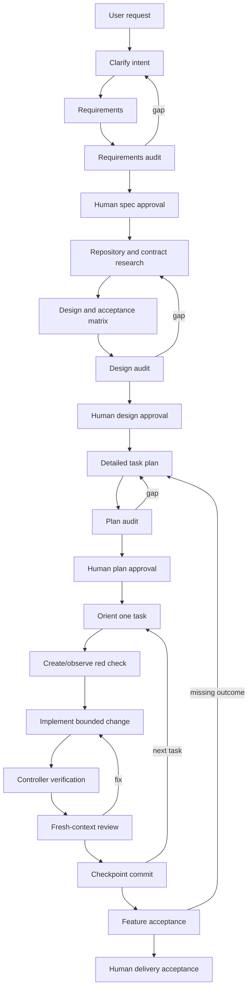

# TinySDD: spec-driven development for tiny coding models

**Status:** historical framework proposal; superseded for current scope  
**Date:** 2026-09-04  
**Name:** Tiny-Model Spec-Driven Development (TinySDD)  
**Audience:** engineers running open-weight coding models on consumer hardware  
**Current scope:** [current-scope.md](current-scope.md)

[current-scope.md](current-scope.md) is authoritative for the approved v0
direction and current implementation work. This document and its dated
supporting documents preserve earlier exploration; they do not define current
requirements or implementation prerequisites.

The historical implementation-level prototype design is
[prototype-architecture.md](prototype-architecture.md). The accompanying
[model evaluation plan](model-evaluation-plan.md) and
[pilot results](model-evaluation-results-2026-09-04.md) turn runtime assumptions
into explicit experiments.

## Executive summary

This document proposes a **new framework**, not a WDD mode, extension, or
compatibility layer.

TinySDD is designed for coding models in roughly the 27B-35B range, including
sparse models with about 3B-4B active parameters, running locally with context
windows up to 128K. These models can research a repository, write specifications,
design a solution, plan work, implement it, use tools, and review a diff. The
framework should let them perform that complete workflow without expecting them
to infer the user's unstated intent or preserve a reliable mental model across a
long autonomous session.

Its central mechanism is a **serial checkpoint machine**:

1. The model turns a request into explicit requirements.
2. The human corrects and approves those requirements.
3. Fresh model calls research the repository and external contracts.
4. The model produces an explicit design and verification plan.
5. The human approves the design and task plan.
6. Each small task is executed through orient, red, implement, verify, and review
   checkpoints.
7. The framework proves the complete outcome against the approved acceptance
   matrix before the human accepts delivery.

Every model call gets one job, exact source artifacts, an output schema, a
bounded decision budget, and explicit stop conditions. The controller owns
state, prompt compilation, file permissions, commands, evidence, and recovery.
Chat history is never the source of truth.

The design takes lessons from WDD's experiments with smaller models, but it does
not reuse WDD's lifecycle or implementation. In particular, TinySDD has no
waves, epics, conflict domains, controller/worker fleet, task worktrees, per-task
pull requests, reconciliation cycle, or `wddctl` dependency. It is optimized for
one local model server, one active task, and frequent fresh-context calls.

## The problem

Current local coding models are in an awkward but useful middle ground:

- capable enough that reducing them to autocomplete wastes most of their value;
- reliable on bounded coding and tool-use tasks;
- weaker at resolving underspecified product intent;
- more likely to choose a plausible but wrong interface or error behavior;
- vulnerable to instruction loss when prompts, tool results, and repository
  content accumulate;
- prone to declaring completion after satisfying the most salient happy path;
- able to create convincing tests that merely agree with their own mistake.

A normal agent harness often responds by adding a longer system prompt and a
larger context window. That helps only until important instructions compete with
repository content and tool output. A model that has 128K tokens available does
not need 128K tokens in every call.

The framework should instead reduce the reasoning burden presented at any one
time. Planning absorbs ambiguity once. Artifacts preserve decisions. The
controller compiles only the relevant slice into each execution call. Tests and
state transitions catch deviations.

## Goals

- Let a small local coding model participate in every development phase:
  requirements, research, design, planning, implementation, review, and delivery.
- Work with one model loaded at a time and remain useful when only one model is
  available.
- Require more explicit specifications, tasks, and outcome definitions than a
  frontier-model workflow.
- Keep normal prompt working sets far below the model's maximum context.
- Resume correctly from disk after any model call, crash, model swap, or context
  reset.
- Make ambiguity and missing evidence visible before code is written.
- Prevent the model from expanding scope, inventing contracts, weakening tests,
  or recording work that was not observed.
- Make human checkpoints precise and infrequent enough to remain usable.
- Support any local runtime through a small adapter interface.

## Non-goals

- Coordinating a parallel fleet of coding agents.
- Making every task autonomous regardless of ambiguity or risk.
- Replacing product judgment with a model vote.
- Treating self-review as independent review.
- Encoding project-specific engineering rules in the framework itself.
- Requiring a particular model family, inference server, editor, or language.
- Automatically merging the final result without human acceptance.
- Reusing WDD's state, CLI, file layout, or skills.

## Target operating envelope

The framework targets a capability class, not a permanent list of model names.
Current examples show that this class is practical:

- Qwen3.5-35B-A3B has 35B total and 3B active parameters, native long context,
  tool use, and reported agentic coding capability. Its own card also shows that
  nominal context capacity and long-context task quality are different things.
  [Official model card](https://huggingface.co/Qwen/Qwen3.5-35B-A3B)
- North Mini Code 1.0 is a 30B-A3B model trained for agentic software
  engineering and terminal use, with structured tool-use support.
  [Official model card](https://huggingface.co/CohereLabs/North-Mini-Code-1.0)
- Gemma 4 26B-A4B is a 25.2B MoE with 3.8B active parameters, coding capability,
  and native function calling. [Official model
  card](https://huggingface.co/google/gemma-4-26B-A4B)

The default framework configuration caps usable context at 128K even when a model
advertises more. A model/runtime pair must pass local qualification before it is
trusted with a role. Quantization, chat template, tool parser, reasoning mode,
and sampling configuration are part of that runtime identity.

## Research synthesis

### Lessons extracted from WDD

WDD's [recorded experiments](https://github.com/ivo-toby/wdd/blob/main/docs/why.md#what-the-benchmarks-taught-us) supply useful
failure evidence, especially its recovery of a project with a 35B local model.
TinySDD takes these lessons, not WDD's architecture:

| WDD observation | Transfer into the new framework |
| --- | --- |
| Output quality followed the verification gates more than the model tier. | Acceptance coverage and independent checks are designed before implementation. |
| Fabrication migrated to each external-contract surface that remained ungated. | Request, response, auth, error, and state contracts require read citations or explicit `UNKNOWN`. |
| The smaller model followed deterministic steps and wandered on prose-only mechanics. | The new controller emits templates, validates schemas, limits tools, and chooses the next action. |
| The model claimed reviews or fixes that had not happened. | Only controller-observed commands, diffs, and actor-attributed reviews become evidence. |
| Workers made golden values from their own incorrect output. | Each acceptance condition names an oracle not authored from the implementation result. |
| Adversarial review found specification defects cheaply. | Requirements, design, and plan each receive a counterexample pass before approval. |
| Skipping one review layer let real defects reach final review. | Every task receives at least a fresh-context review; risky tasks require a different model or human. |

### Lessons from adjacent systems

- GitHub Spec Kit separates constitution, specification, clarification, planning,
  tasks, cross-artifact analysis, implementation, and convergence. It recommends
  implementing large features in validated stages. [Agentic
  SDD](https://github.com/github/spec-kit/blob/main/docs/reference/agentic-sdd.md)
- Kiro treats testability, completeness, ambiguity, inconsistency, and solution
  leakage as requirement properties that can be checked before design. It also
  identifies the human as the only oracle for intended meaning. [Requirements
  analysis](https://kiro.dev/blog/deep-spec-analysis/)
- Anthropic recommends prompt chaining with programmatic gates when work can be
  decomposed, environmental ground truth at each step, and explicit stopping
  conditions. [Building effective
  agents](https://www.anthropic.com/engineering/building-effective-agents)
- Anthropic's context guidance favors informative but tight context and
  just-in-time retrieval through stable identifiers over loading everything in
  advance. [Effective context
  engineering](https://www.anthropic.com/engineering/effective-context-engineering-for-ai-agents)
- SWE-agent found that small file views, terse search results, syntax checking,
  and carefully designed tools improved repository work; extra match context
  could confuse the model. [Agent-computer interface
  notes](https://github.com/SWE-agent/SWE-agent/blob/main/docs/background/aci.md)
- Long-context research found that models can use information less reliably when
  it appears in the middle of a long input. [Lost in the
  Middle](https://arxiv.org/abs/2307.03172)

The combined implication is not “write a bigger prompt.” It is “turn one large
reasoning problem into a chain of small, validated transformations.”

## Framework principles

1. **The human owns meaning.** The model exposes interpretations; the human
   chooses among materially different outcomes.
2. **One call has one responsibility.** Interviewing, auditing, repository
   mapping, design, task compilation, editing, and review are separate calls.
3. **Fresh context is normal.** Continuity comes from approved files and state,
   not an inherited conversation.
4. **The controller owns mechanics.** State changes, commands, file permissions,
   prompt assembly, retries, and evidence are deterministic operations.
5. **Artifacts have one owner.** A fact is edited in one canonical artifact and
   referenced elsewhere by stable ID.
6. **Unknown is a valid result.** The model stops on missing intent, unseen
   contracts, or repository contradictions.
7. **Implementation begins only when decisions are closed.** A task states every
   allowed local choice and contains no unresolved architectural choice.
8. **Checks must be able to disagree with the implementation.** Passing a test
   created from the same mistaken assumption is not independent evidence.
9. **Every mutation invalidates downstream judgment.** Review and verification
   bind to exact inputs and the current Git tree.
10. **Retries are finite and diagnostic.** Repeated failure causes re-specification,
    task splitting, a different model, or human intervention.

## What is deliberately different from WDD

| Concern | WDD | TinySDD |
| --- | --- | --- |
| Primary problem | Coordinating work larger than one prompt across tasks/agents | Making one small local model reliable through a complete feature lifecycle |
| Execution shape | Controller, workers, reviewers, potentially concurrent | One serial stage runner; roles are fresh calls, not an agent hierarchy |
| Git isolation | Scope and task branches with worktrees | One feature branch; one active task; checkpoint commits |
| Scheduling | Dependencies, conflict domains, concurrency admission | Ordered task queue; no scheduler or conflict model |
| Unit of control | Task lifecycle plus scope lifecycle | Every artifact transformation and intra-task checkpoint |
| Context | Task brief plus selected snapshots | Stage-specific compiled prompt with hot/warm/cold context budgets |
| Review | Separate reviewer role based on policy | Fresh-context audit always; optional/required cross-model or human escalation |
| Delivery | Per-task merges followed by epic delivery | Task checkpoint commits followed by one feature handoff |
| CLI/state | `wddctl` and `.wdd/` | New `tinysdd` and `.tinysdd/`; no compatibility contract |

WDD remains a research input. The new framework should be implementable in a
repository that has never installed or heard of WDD.

## Architecture

### Components

TinySDD has five small components:

1. **Controller core** — a deterministic state machine that emits one next
   action, validates artifacts, binds approvals, and invalidates stale evidence.
2. **Prompt compiler** — combines a compact constitution, one stage instruction,
   an action card, and selected source excerpts within a token budget.
3. **Model adapter** — invokes an OpenAI-compatible endpoint or local agent CLI,
   exposes tools, validates structured output, and captures the transcript.
4. **Repository sandbox** — constrains reads/writes, records diffs, runs approved
   commands, and owns Git checkpoint operations.
5. **Artifact/evidence store** — human-readable project files plus
   machine-generated manifests, hashes, command observations, and review results.

The model never writes controller state. The controller never interprets product
meaning. The adapter never decides that an invalid response is “close enough.”

### Two linked loops



The upper loop turns intent into an approved executable specification. The lower
loop executes one bounded task at a time. A downstream problem returns to the
artifact that owns it; it is not patched over in a prompt.

### Role calls, not agent personas

The framework uses role-specific calls:

| Call | One responsibility | Write authority |
| --- | --- | --- |
| Interviewer | Find materially different interpretations and ask one batch of questions | `questions.md` only |
| Requirements writer | Convert approved answers into observable behavior | `requirements.md` only |
| Requirements auditor | Produce counterexamples and ambiguity findings | review artifact only |
| Repository scout | Map exact relevant symbols, tests, and conventions | research artifacts only |
| Contract researcher | Record externally sourced shapes and unknowns | contract inventory only |
| Designer | Resolve technical structure and verification strategy | `design.md`, `acceptance.md` |
| Plan compiler | Produce ordered tasks and self-contained briefs | task artifacts only |
| Executor | Complete one checkpoint action for one task | phase-specific write set |
| Reviewer | Compare the current diff with its approved brief and checks | review artifact only |
| Acceptance auditor | Walk all acceptance IDs against the finished branch | final report only |

These calls may all use the same local model. A different model or a human can be
inserted for audit calls without changing the lifecycle.

## Lifecycle

### Phase 0: project setup

`tinysdd init` creates `.tinysdd/`, detects the repository language and verification
commands, initializes a feature-branch policy, and asks the human to ratify:

- the compact constitution;
- allowed command categories;
- the maximum context and output budget;
- the runtime/model identities available;
- risk rules that require cross-model or human review.

Setup runs a qualification suite for each runtime. The suite checks exact JSON
output, tool calling, bounded search, file reading, patching, command execution,
scope refusal, and fresh-context continuation. The result is a capability
manifest, not a universal model grade.

### Phase 1: request capture

`tinysdd new` records the user's request verbatim in `request.md`. The framework
never rewrites this file; it is provenance, not the specification.

The interviewer reads the request and returns:

- its one-sentence understanding;
- actors and desired observable outcomes;
- assumptions already explicit in the request;
- materially different interpretations;
- missing state, error, permission, ordering, scale, compatibility, and rollout
  decisions;
- one batched set of questions.

The controller rejects generic questions such as “anything else?” Each question
must state why its answer changes behavior and present concrete alternatives when
possible. The human's answers are appended verbatim to `answers.md`.

### Phase 2: requirements specification

The requirements writer converts `request.md` and `answers.md` into a behavioral
specification. It must describe what is observed, not the implementation.

Required sections:

```markdown
# Requirements: <feature>

## Outcome
## Actors and glossary
## In scope
## Out of scope
## Preconditions
## Scenarios
## State and decision tables
## Invariants and permissions
## Failure behavior
## Non-functional constraints
## Acceptance criteria
```

Every requirement and acceptance criterion receives a stable ID. A scenario uses
an explicit condition/action/outcome form:

```markdown
- R-3 / AC-7
  - Given: an authenticated user owns project P.
  - When: the user requests deletion of P while P has active jobs.
  - Then: deletion is rejected with error E_ACTIVE_JOBS and no state changes.
```

For stateful behavior, prose is not enough. The specification includes a complete
transition or decision table with every state/input pair accounted for.

The controller runs deterministic checks:

- IDs are unique and stable;
- every AC has observable inputs, condition, outcome, and prohibited side effect;
- no `TBD`, `UNKNOWN`, “appropriate,” “properly,” “as needed,” or unbounded
  “handle” remains;
- permissions and failures exist for each operation;
- non-functional claims include a measurable bound or are explicitly out of
  scope;
- acceptance criteria do not prescribe an implementation unnecessarily.

A fresh auditor then tries to produce concrete counterexamples. Findings return
to the requirements writer. The human approves the exact final bytes.

### Phase 3: grounded research

Research is split to protect the model from repository-scale context.

The repository scout first produces `repo-map.md` containing only facts it has
read:

- relevant paths and symbols;
- entrypoints and call paths;
- existing tests and fixtures;
- build, lint, type-check, and test commands;
- conventions demonstrated by nearby code;
- likely integration surfaces;
- citations as `path:start-end`.

The contract researcher produces `contracts.md` for external or shared
interfaces:

| ID | Operation | Request | Response | Auth | Errors/state | Source |
| --- | --- | --- | --- | --- | --- | --- |
| `EXT-1` | Create item | exact method/path/body | exact envelope/fields | exact rule | exact errors | read citation |

An unseen source is written as `UNKNOWN: source not read`. The controller does
not allow an interface that depends on such a row to enter design. The honest
options are: fetch and read it, remove the dependency, or obtain an explicit
human waiver with a verification plan.

Research uses narrow tools: search returns filenames and small snippets; reads
default to 100-200 lines; large output is stored on disk and summarized with
citations. The model does not receive a repository dump.

### Phase 4: technical design

The designer turns approved behavior and grounded repository facts into an
implementation design. Required sections:

```markdown
# Design: <feature>

## Outcome architecture
## Components and responsibilities
## Interfaces
## Data and state
## Algorithms and control flow
## Error and recovery paths
## Security and trust boundaries
## Repository change map
## Compatibility, migration, and rollback
## Decisions and rejected alternatives
## Feature deliverable
```

Each component, interface, and material decision receives a stable ID. Interface
entries cite `contracts.md` rather than restating remembered external facts.

The repository change map names symbols and files expected to change. It is not
yet an authorization list; it is the basis for task compilation.

The design must close choices that a small executor should not make:

- exact data and API shapes;
- state transitions and idempotency;
- error mapping;
- ordering and concurrency behavior;
- migration/fallback behavior;
- ownership of shared wiring;
- library choices or explicit permission to use an existing dependency;
- what must remain unchanged.

### Phase 5: acceptance design

The designer also creates `acceptance.md`, a first-class executable outcome
matrix:

| Check | Requirement/AC | Observation | Oracle | Command/procedure | Independent source | Stage |
| --- | --- | --- | --- | --- | --- | --- |
| `CHK-4` | `AC-7` | deletion fails and state is unchanged | existing integration fixture | exact command | pre-existing test | task + feature |

Every AC needs at least one check. Every task needs at least one check that was
not derived from the executor's output. Acceptable independent sources include:

- a pre-existing repository test;
- a cited protocol conformance fixture;
- a human-approved expected value;
- an independently authored test or property;
- observable execution against a controlled reference system.

A test generated by the executor from its own implementation is useful for red
and green, but it cannot be the only acceptance oracle.

The design auditor checks requirements, research, design, and acceptance as one
graph. The human approves design and acceptance together.

### Phase 6: task compilation

The plan compiler creates a serial `tasks.json` and one detailed brief per task.
The plan contains no concurrency metadata because only one task may be active.

Tasks are ordered by real data/interface dependencies. Shared registration,
routing, exports, migrations, and end-to-end wiring are explicit tasks, never an
assumption that some executor will notice them.

Default task-budget warnings for the initial framework:

- one primary deliverable;
- one acceptance criterion, or a small inseparable group;
- at most one cross-component or external interface;
- at most three implementation files and two test/fixture files;
- expected handwritten diff below roughly 250 lines;
- hot compiled context at or below 24K tokens;
- zero unresolved research facts;
- zero architectural decisions;
- at most one bounded local choice.

The numbers are tunable pilot defaults, not laws. Exceeding one produces a
split-or-waive checkpoint; the planner may not silently emit a large task.

The plan auditor checks:

- every AC is owned by at least one task and acceptance check;
- every design component and repository surface has a task or explicit
  no-change justification;
- no task consumes an interface produced later;
- no task depends on an unresolved choice or unknown fact;
- task write sets do not hide unrelated responsibilities;
- integration and feature-verification tasks exist;
- the order can be resumed after every task commit.

The human sees a compact plan table and approves the plan and all brief digests.

### Phase 7: task readiness

Before editing, the executor runs in read-only mode and produces a readiness
record:

```json
{
  "kind": "tinysdd.readiness.v1",
  "task": "T-004",
  "deliverable": "exact brief sentence",
  "requirements": ["AC-7"],
  "checks": ["CHK-4", "CHK-5"],
  "reads": ["src/jobs/service.py:40-120", "design.md#IF-2"],
  "writeSet": ["src/projects/delete.py", "tests/test_delete.py"],
  "decisionBudget": "NONE",
  "unknowns": [],
  "contradictions": [],
  "nextAction": "WRITE_RED_TEST"
}
```

The controller compares this with the approved brief. It also confirms the
working tree is clean and, where the adapter exposes tool traces, that required
reads were actually opened. Any difference returns to planning. A readiness
statement cannot expand authority.

### Phase 8: red checkpoint

The executor receives a fresh prompt permitting writes only to declared test or
fixture paths. It adds the smallest test implied by the brief. The controller,
not the model, runs the named check and records:

- exact command and working directory;
- exit code and bounded output;
- expected and observed failure signature;
- Git tree and artifact digests;
- files changed during the phase.

A collection error, syntax error, or unrelated failure is not red. If the test
already passes, the model must explain whether the behavior exists already, the
test is ineffective, or the task is unnecessary. The controller does not advance
on a generic “red complete” statement.

Documentation and mechanical configuration tasks may declare `NO_RED` in the
approved brief with an alternative observable check.

### Phase 9: implementation checkpoint

The executor receives another fresh prompt containing:

- the one task brief;
- exact relevant requirements and design IDs;
- cited repository/contract excerpts;
- the observed red evidence;
- the bounded implementation write set;
- one action: make the red check pass;
- explicit stop conditions.

It may use repository search and reads, but may only write approved paths. If a
new file, dependency, interface, or decision is needed, it stops with
`NEEDS_REPLAN` and the exact reason.

After the call, the controller rejects changes outside the write set, protected
test modifications, generated junk, or dependency changes not named by the
brief. It then runs the focused green check.

### Phase 10: verification checkpoint

The model does not tell the controller that tests passed. The controller runs all
approved task commands itself:

1. focused behavior checks;
2. independent oracle checks;
3. type/lint/static checks relevant to the changed files;
4. the configured regression subset.

Evidence binds to the current Git tree. Any later mutation makes it stale.

### Phase 11: review checkpoint

A fresh read-only call receives the brief, relevant specification excerpts,
acceptance checks, current diff, and command evidence. It checks, in order:

1. deliverable and prohibited effects;
2. each acceptance ID;
3. interface and external-contract fidelity;
4. failure, permission, state, and concurrency behavior;
5. whether tests can fail and exercise the production path;
6. security and data handling;
7. write-set and decision-budget compliance.

The result is structured findings only:

- `BLOCKER`: correctness, security, contract, or objective failure;
- `MAJOR`: real defect, missing disagreement-capable test, or material
  maintainability risk;
- `MINOR`: non-blocking improvement.

The baseline works with the same model in a fresh context, but records that as
`self_model_fresh_context`, not independent review. Review levels are explicit:

| Level | Reviewer | Use |
| --- | --- | --- |
| R0 | same model, fresh context and adversarial prompt | mandatory minimum; catches attention and completeness errors |
| R1 | different local checkpoint or model family | public interfaces, persistence, auth, migrations, or repeated R0 findings |
| R2 | human | product semantics, security-sensitive changes, accepted uncertainty, final delivery |

The controller allows at most two automatic fix/review rounds. A third blocker
returns to task compilation, R1/R2 review, or human judgment.

### Phase 12: checkpoint commit

When verification and required review levels pass, the controller creates one
task commit on the feature branch. The commit message includes the task ID. State
records the commit, artifact digests, checks, review, and runtime identity.

The next task starts from a fresh model context and the committed repository.
There is no reconciliation ceremony: serial commits are the shared truth. If a
completed task changes an interface consumed by later briefs, the controller
marks those briefs stale and returns to plan approval.

### Phase 13: feature acceptance and delivery

After the last task, the acceptance auditor walks every row in `acceptance.md`
against the complete feature branch. The controller runs:

- all feature-level acceptance commands;
- the project verification commands;
- startup/smoke or end-to-end commands named by the deliverable;
- migration/rollback checks where specified.

The generated `handoff.md` contains:

- outcome delivered;
- AC-by-AC evidence table;
- commits and changed surfaces;
- decisions and accepted waivers;
- remaining limitations explicitly permitted by the spec;
- exact reproduction commands;
- rollback instructions.

The human reviews the outcome and decides whether to merge. The framework never
converts “all commands green” into an assertion that the user's intent was met
without this final acceptance.

## Artifact layout

```text
.tinysdd/
  constitution.md              # compact project rules, human-approved
  config.json                  # machine settings and runtime adapters
  control/                     # controller-owned and ignored by Git
    events/                    # immutable authoritative event records
    state.json                 # disposable projection rebuilt by replay
    blobs/                     # content-addressed raw output/evidence
  project/
    overview.md                # stable, small repository description
    commands.json              # controller-approved commands
    runtimes/<name>.json       # qualified model/runtime identities
  work/<feature-id>/
    request.md                 # immutable user request
    questions.md               # interviewer output
    answers.md                 # verbatim human answers
    requirements.md            # approved behavioral truth
    repo-map.md                # cited repository facts
    contracts.md               # cited external/shared contracts
    design.md                  # approved technical decisions
    acceptance.md              # AC -> check -> oracle matrix
    tasks.json                 # ordered machine-readable plan
    tasks/T-###.md             # self-contained executor briefs
    reviews/                   # immutable artifact and diff reviews
    evidence/                  # command results and generated trace matrix
    handoff.md                 # final human-facing delivery record
  runtime/                     # transient prompts, logs, and tool traces
```

Only `control/` and `runtime/` are controller-owned. Human-readable artifacts
remain plain Markdown or JSON and travel with the repository. Every approval
records an artifact digest. Generated trace reports are never editable sources of
truth. The event directory is authoritative and `state.json` is derived; replay
must recover the same projected state after a crash.

## The task brief contract

Task briefs are intentionally closer to implementation recipes than frontier
agent prompts. They remove choices without dictating trivial syntax.

```markdown
# T-004: Reject project deletion while jobs are active

## Outcome
Deleting a project with any active job returns E_ACTIVE_JOBS and changes no
project or job state.

## Requirement and design links
- AC-7
- CMP-3 ProjectLifecycle
- IF-2 DeleteProjectResult
- CHK-4, CHK-5

## Preconditions
- T-002 is committed.
- `JobState.active` is the canonical activity predicate.

## Required reads
- `src/jobs/service.py:40-120`
- `src/projects/delete.py:1-160`
- `design.md#IF-2`

## Inputs and outputs
- Consumes: project ID and authenticated caller from IF-2.
- Produces: success or exact E_ACTIVE_JOBS result from IF-2.
- Side effects: none on rejection.

## Write set
- `src/projects/delete.py` — add the guard before mutation.
- `tests/test_project_delete.py` — add the rejection scenario.

## Protected behavior
- Do not change successful deletion.
- Do not change job state definitions.
- Do not add a dependency.

## Implementation recipe
1. Add a failing test that creates one active job and snapshots project/job state.
2. Call the public deletion entrypoint.
3. Assert E_ACTIVE_JOBS and byte-for-byte unchanged state.
4. In the production entrypoint, query the existing activity predicate before
   the first mutation.
5. Return the existing IF-2 error variant.

## Edge and failure cases
- Missing project follows existing E_NOT_FOUND behavior.
- Completed jobs do not block deletion.
- Any active job blocks; do not depend on ordering.

## Decision budget
NONE. Stop if IF-2 or the activity predicate differs from the cited design/code.

## Checks
- RED/GREEN: `pytest -q tests/test_project_delete.py -k active_job`
- INDEPENDENT CHK-4: existing state-snapshot helper and approved expected error.
- REGRESSION: `pytest -q tests/test_project_delete.py`

## Stop conditions
- A required extra file, schema change, dependency, or interface decision.
- Any contradiction with a cited source.

## Completion response
Return changed paths, observed concerns, decisions (`NONE` allowed), and exactly
one status: DONE, NEEDS_REPLAN, NEEDS_CONTEXT, or BLOCKED.
```

## Prompt architecture

### Four layers

Every request to the model is compiled from four versioned layers:

1. **Constitution** — short invariant rules, normally below 700 tokens.
2. **Stage instruction** — one role, one action, allowed tools, and output schema.
3. **Action card** — feature/task IDs, exact artifact digests, write authority,
   stop conditions, and current evidence.
4. **Selected context** — only cited excerpts and file references needed now.

The model does not receive the planning conversation, prior implementation chat,
or full controller state.

### Context tiers

| Tier | Contents | Rule |
| --- | --- | --- |
| Hot | action, brief, exact AC/design/check excerpts, current evidence | included now; pilot target <=24K tokens |
| Warm | approved files named by the action card | available through precise file reads |
| Cold | rest of repository/dependencies | targeted search only |

The prompt begins with the action and authority boundary. It ends with stop
conditions and the output schema, giving critical information both primacy and
recency.

At least 25% of the served context window is reserved for model output and tool
observations. If hot context exceeds its budget, prompt compilation fails with
`TASK_TOO_LARGE`; it never silently truncates an approved artifact.

The 24K and 25% values are starting hypotheses to benchmark, not claims about a
universal optimum.

### Stage instruction example

```text
ROLE: task executor
ACTION: implement one approved task from observed red evidence

MUST:
- read the action card and named excerpts;
- write only paths in WRITE_SET;
- implement only OUTCOME;
- stop on any STOP_CONDITION;
- return the declared JSON/status schema.

MUST NOT:
- edit requirements, design, checks, controller state, or protected tests;
- add files, dependencies, interfaces, or behavior not authorized;
- claim a command passed; the controller runs commands;
- infer missing contracts or product intent.
```

Stage prompts are directives, not personas or motivational prose. Each tool and
output field includes one correct example and one boundary case.

## Agent-computer interface

The model sees a small consistent tool surface even if the adapter uses a shell
or editor underneath:

| Tool | Behavior |
| --- | --- |
| `repo.search(query, paths)` | Returns matching paths and bounded snippets; never a repository dump. |
| `repo.read(path, start, end)` | Reads a bounded range and records the observation. |
| `repo.patch(path, patch)` | Applies a patch only when the path is writable in the current stage. |
| `repo.status()` | Returns concise changed-file and diff-size state. |
| `check.run(check_id)` | Controller executes the pre-approved command and stores full output. |
| `shell.run(command_id, args)` | Runs an allowlisted command template; arbitrary shell is opt-in per project. |
| `stage.finish(result)` | Validates the stage schema and proposed status; it does not self-approve evidence. |

The adapter always uses repository-absolute paths internally, caps output, and
turns empty output into an explicit success/failure observation. Invalid tool
arguments receive one concise correction. A second schema failure terminates the
call and records an adapter failure rather than starting an open-ended repair
conversation.

## State machine

The top-level states are:

```text
SETUP
-> CLARIFY
-> REQUIREMENTS_DRAFT
-> REQUIREMENTS_AUDIT
-> REQUIREMENTS_APPROVAL
-> RESEARCH
-> DESIGN_DRAFT
-> DESIGN_AUDIT
-> DESIGN_APPROVAL
-> PLAN_DRAFT
-> PLAN_AUDIT
-> PLAN_APPROVAL
-> TASKS
-> FEATURE_ACCEPTANCE
-> DELIVERY_APPROVAL
-> DELIVERED
```

Each task has:

```text
PENDING
-> READY_CHECK
-> RED
-> IMPLEMENT
-> VERIFY
-> REVIEW
-> FIX        # bounded loop back to VERIFY/REVIEW
-> COMMIT
-> DONE
```

Any artifact edit invalidates approvals and downstream state according to its
position in the lifecycle. Any code mutation invalidates task verification and
review. A runtime identity change invalidates model-produced audit/review
evidence but not controller-run checks at an unchanged Git tree.

The state file records events atomically and is never a prompt input wholesale.
`tinysdd next` emits one compact action with the exact controller command or model
stage required.

## Proposed CLI

```text
tinysdd init
tinysdd runtime qualify <name>
tinysdd new <feature-id>
tinysdd next
tinysdd stage prompt
tinysdd stage run
tinysdd artifact lint <requirements|research|design|acceptance|plan>
tinysdd artifact audit <requirements|design|plan>
tinysdd approve <requirements|design|plan|delivery> --by <name>
tinysdd task ready <task-id>
tinysdd task red <task-id>
tinysdd task implement <task-id>
tinysdd task verify <task-id>
tinysdd task review <task-id> --level R0|R1|R2
tinysdd task commit <task-id>
tinysdd acceptance run
tinysdd status
```

The normal user does not need to memorize these. A driver repeatedly calls
`tinysdd next` and executes the returned action. The CLI exists so rules are
enforced by code rather than trusted to a system prompt.

## Compact constitution

This is the default project constitution. Project-specific additions should keep
the same imperative form and remain short.

```markdown
# TinySDD development constitution

1. The approved requirements define behavior. The approved design defines
   interfaces and structure. The active task defines current authority. Surface
   conflicts; do not choose silently.
2. Perform only the current stage action. Do not skip, combine, or invent stages.
3. Read every required source before using its facts. If a contract or repository
   fact cannot be cited, return `NEEDS_CONTEXT`; do not guess.
4. Write only files in the current write set. Stop before adding a file,
   dependency, interface, migration, or unrelated cleanup.
5. Make only choices listed in the task's decision budget. Return
   `NEEDS_REPLAN` for every larger choice.
6. Preserve protected behavior and tests. Never weaken, delete, bypass, or rewrite
   a check merely to make it pass.
7. A model response is not evidence that a command ran. Only controller-observed
   results may be reported as passed or failed.
8. Worker-authored tests are not the sole acceptance oracle. Run and preserve the
   independent checks named by the task.
9. Report contradictions with exact paths, symbols, inputs, and observations.
   Do not redesign around them during implementation.
10. Never record another actor's approval or review. Distinguish observation,
    inference, and uncertainty in every completion report.
11. Dissent once with a concrete failure case and the evidence that would change
    it. After the human records a decision, follow it.
12. Stop states are successful outcomes. `NEEDS_CONTEXT`, `NEEDS_REPLAN`, and
    `BLOCKED` are safer than plausible invention.
```

## Human checkpoints

More checkpoints should not mean constant interruption. The human owns only
meaningful decisions:

| Checkpoint | What the human sees | Why it cannot be automated safely |
| --- | --- | --- |
| Requirements approval | outcome, scope, state/error tables, ACs, open waivers | only the user knows intended behavior |
| Design approval | architecture, interfaces, risks, acceptance oracles, rollback | expensive technical choices and accepted risk |
| Plan approval | ordered outcomes, task sizes, write sets, checks | confirms the framework will build the right increments |
| Exception | one concrete ambiguity, unknown contract, scope expansion, or retry limit | requires authority beyond the active task |
| Delivery approval | AC evidence, running outcome, limitations, rollback | green checks do not prove product intent |

Everything else—schema validation, command execution, hashes, write-set checks,
staleness, prompt compilation, and checkpoint recording—is mechanical.

## Failure and escalation policy

| Failure | Framework response |
| --- | --- |
| Requirements admit two behaviors | ask one focused human question and revise requirements |
| External contract not read | record `UNKNOWN`, block dependent design, fetch/read or waive |
| Repository fact contradicts design | return to research/design; never patch around it |
| Task prompt exceeds context target | narrow cited context or split the task |
| Readiness record differs from brief | reject and return to plan compilation |
| Red check passes or fails for wrong reason | repair the test/task definition before implementation |
| Model writes outside its phase set | revert that stage's uncommitted changes and mark `SCOPE_BREACH` |
| Implementation needs a new decision | `NEEDS_REPLAN`; update owning artifact and invalidate dependants |
| Check fails | one diagnosis call using only relevant evidence, then bounded fix |
| Review returns blocker/major | bounded fix and complete re-verification/review |
| Two blocking review rounds | split task, switch reviewer/model, or ask human |
| Invalid structured output twice | fail the stage and record adapter/runtime issue |
| Model claims unobserved work | ignore claim; state does not move |
| Approved artifact changes | invalidate every downstream approval and task packet |
| Model/runtime config changes | re-qualify; stale affected model judgment evidence |

Reverting a scope-breaching stage is safe because only one task is active and the
controller creates a clean Git marker before every write-enabled call.

## Runtime qualification and routing

The framework fingerprints:

- model repository and revision or local weights digest;
- quantization;
- inference engine and version;
- tokenizer and chat template;
- reasoning/tool modes;
- sampling configuration;
- context/output limits;
- adapter and tool-schema versions.

Qualification runs multiple seeds for:

- strict output-schema compliance;
- correct tool selection and arguments;
- reading exact cited files;
- concise repository search;
- stopping on a deliberately missing contract;
- bounded test-and-patch work;
- finding a seeded defect in fresh-context review;
- resuming a task from artifacts with no conversation history.

Roles are enabled by demonstrated capability. A runtime might qualify for
implementation but not requirements auditing. If only one runtime exists, the
framework remains operable with R0 review and human approvals; it reports the
reduced independence honestly.

Sampling values should follow the model's official guidance and local
qualification. The framework should not force one temperature across planning,
tool use, and structured review.

## Definitions of ready and done

### Feature ready for implementation

- Requirements, design, acceptance matrix, plan, and briefs are approved and
  digest-current.
- No unresolved `UNKNOWN` or waiver lacks an owner and check.
- Every AC maps to a design element, task, and independent oracle.
- Every expected repository surface has one task owner.
- Every task fits its context and judgment budget or has a human-approved waiver.
- The runtime is qualified for every assigned stage.

### Task done

- The approved outcome exists and protected behavior remains unchanged.
- Red evidence was observed or an approved alternative applies.
- Focused, independent, static, and regression checks required by the brief pass
  at the current Git tree.
- Required review has no blocker or major finding.
- The diff stays inside the write set and decision budget.
- Decisions, concerns, and evidence are recorded.
- One checkpoint commit exists for the task.

### Feature done

- Every acceptance row passes against the complete feature branch.
- The end-to-end deliverable runs as specified.
- No evidence or approval is stale.
- No blocker, major finding, unresolved unknown, or unaccepted waiver remains.
- The handoff includes reproduction and rollback instructions.
- The human has accepted the result.

## Evaluation plan

The framework should be evaluated against an ordinary local-agent baseline, not
against WDD as an implementation dependency.

### Experiment

Run at least three repeated seeds for each target runtime on:

1. the CHIP-8 emulator used in WDD experiments, preserving its renderer and
   timing failure modes;
2. the API/MCP recovery case where a 35B model fabricated request, response, and
   OAuth contracts;
3. an unseen brownfield feature with state, failures, and integration wiring;
4. a small task where the framework should decide its own overhead is not
   justified and use a shortened path.

Compare:

- the model's normal agent harness with a conventional task prompt;
- the same runtime, tools, hardware, and user intent under TinySDD.

Do not use a frontier model to rescue execution. It may grade anonymized results
after human grading.

### Measures

- acceptance-criterion completion verified by independent oracles;
- semantic defects escaping task and feature review;
- fabricated or uncited contract elements;
- scope breaches and test-weakening attempts;
- requirement/design/plan defects caught before implementation;
- task splits, retry rounds, and human exception minutes;
- prompt, tool-output, and generation tokens per stage;
- wall time, model-load time, and peak memory;
- variance across seeds;
- successful resume from disk after every checkpoint;
- framework overhead on tasks that did not need the full lifecycle.

### Initial acceptance bar

- zero fabricated human approvals, reviews, or command evidence;
- zero delivered external-contract fields without a read citation or explicit
  waiver;
- complete AC-to-check-to-evidence traceability;
- no task commit with out-of-scope writes or stale evidence;
- lower semantic-defect escape rate than the ordinary harness;
- human effort concentrated in requirement/design decisions and exceptions;
- a documented fast path for work whose risk and ambiguity do not justify the
  full process.

## Delivery roadmap

### Milestone 1: executable artifact chain

- `.tinysdd/` layout and standalone `tinysdd` state machine;
- request, requirements, design, acceptance, plan, and brief templates;
- artifact digests, approval invalidation, and cross-artifact trace lint;
- compact constitution and stage prompt compiler.

### Milestone 2: guarded task loop

- repository tools with bounded output and phase write sets;
- readiness, red, implement, verify, review, and commit transitions;
- controller-executed commands and evidence capture;
- clean-stage rollback after scope breach.

### Milestone 3: local runtime adapters

- OpenAI-compatible HTTP adapter;
- generic headless CLI adapter;
- runtime qualification and fingerprinting;
- R0/R1/R2 review policy.

### Milestone 4: benchmark and tune

- replay known WDD small-model failures;
- run unseen brownfield work across dense and sparse runtimes;
- tune task/context budgets from trajectories;
- define the shortened path for low-risk, well-specified changes.

## Risks and open decisions

- **Specification overhead:** detailed briefs can cost more than implementing a
  small change. The framework needs a measured fast path, not universal ceremony.
- **Same-model blind spots:** fresh context reduces anchoring but is not
  independence. High-risk review needs another model or human.
- **Artifact duplication:** requirements, design, briefs, and prompts may repeat
  facts. Stable IDs and generated excerpts must keep one editable owner.
- **Prompt compiler quality:** a bad compiler can omit essential context while
  appearing precise. Compilation manifests and missing-reference failures are
  required.
- **Tool compatibility:** some local agent CLIs cannot expose phase-specific
  permissions. The portable fallback is a clean Git marker plus post-call diff
  enforcement and rollback.
- **Model swapping:** R1 review may require loading a second large model. This is
  slower but compatible with consumer hardware because execution is serial.
- **Command safety:** arbitrary shell access conflicts with deterministic
  evidence and sandboxing. Projects need a clear allowlist plus a human-gated
  escape hatch.
- **Expected-value provenance:** the oracle schema must prevent a model from
  labeling its own generated output as independently confirmed.
- **Brownfield uncertainty:** some repository facts only emerge during
  implementation. Returning to design must be cheap and expected, not treated as
  framework failure.

## Recommended first prototype

Build a standalone vertical slice with only these states:

```text
REQUEST -> CLARIFY -> REQUIREMENTS -> REQUIREMENTS_AUDIT
-> HUMAN_APPROVAL -> REPOSITORY/CONTRACT_RESEARCH
-> DESIGN/ACCEPTANCE -> DESIGN_AUDIT -> HUMAN_APPROVAL
-> ONE_TASK_PLAN -> PLAN_AUDIT -> HUMAN_APPROVAL
-> PLANNING_CHECKPOINT -> READINESS -> RED -> IMPLEMENT
-> VERIFY -> R0_REVIEW -> CHECKPOINT_COMMIT -> FEATURE_ACCEPTANCE
-> HUMAN_DELIVERY_APPROVAL
```

Use one qualified local runtime and one feature branch. Implement the event-backed
controller, prompt compiler, bounded repository tools, artifact digests,
dependency invalidation, write-set enforcement, controller-run checks, and oracle
provenance. The approved planning artifacts are committed before task readiness
so execution begins from a clean tree. Run the slice against a frozen
contract-fabrication fixture using the protocol in
[model-evaluation-plan.md](model-evaluation-plan.md).

That experiment answers the framework's core question without importing WDD's
orchestration machinery: can a small model produce a materially better outcome
when intent, context, decisions, and evidence are compiled into a sequence of
small enforceable jobs?

## References

Primary external sources checked on 2026-09-03 and 2026-09-04:

- [Qwen3.5-35B-A3B official model card](https://huggingface.co/Qwen/Qwen3.5-35B-A3B)
- [North Mini Code 1.0 official model card](https://huggingface.co/CohereLabs/North-Mini-Code-1.0)
- [Gemma 4 26B-A4B official model card](https://huggingface.co/google/gemma-4-26B-A4B)
- [GitHub Spec Kit: Agentic SDD](https://github.com/github/spec-kit/blob/main/docs/reference/agentic-sdd.md)
- [Kiro: Requirements analysis](https://kiro.dev/blog/deep-spec-analysis/)
- [Anthropic: Building effective agents](https://www.anthropic.com/engineering/building-effective-agents)
- [Anthropic: Effective context engineering for AI agents](https://www.anthropic.com/engineering/effective-context-engineering-for-ai-agents)
- [SWE-agent: Agent-computer interface](https://github.com/SWE-agent/SWE-agent/blob/main/docs/background/aci.md)
- [Liu et al.: Lost in the Middle](https://arxiv.org/abs/2307.03172)
